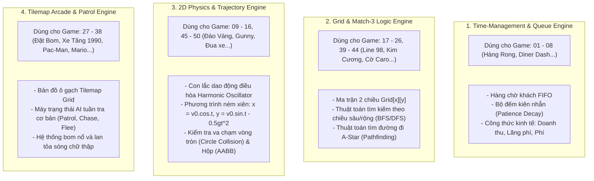

# TÀI LIỆU ĐẶC TẢ & THU THẬP DỮ LIỆU 50 TRÒ CHƠI KINH ĐIỂN
## BỘ DỮ LIỆU THIẾT KẾ CƠ CHẾ, TÍNH NĂNG, VẬT PHẨM & TÀI SẢN NGUỒN MỞ HỢP PHÁP
**Dự án:** NewPlayground (Hệ sinh thái game web hoài niệm & nguyên bản)
**Tiêu chuẩn văn bản:** Font Calibri, chuẩn hóa hiển thị đa nền tảng, thiết kế rõ ràng và chuyên nghiệp.

---

## NGUYÊN TẮC THU THẬP & SẠCH BẢN QUYỀN (CLEAN-ROOM SPECIFICATION)

Để đảm bảo NewPlayground **không bao giờ bị khiếu kiện bản quyền (DMCA), không bị khóa kho mã nguồn GitHub hay chặn tên miền**, toàn bộ dữ liệu 50 tựa game dưới đây được thu thập và chuẩn hóa theo phương pháp **Clean-room Reverse Engineering**:
1. **Bóc tách Cơ chế (Mechanics & Logic):** Trích xuất toàn bộ công thức toán học, vòng lặp chơi (Core Loop), danh mục vật phẩm, hành vi nhân vật và cơ chế điều khiển của 50 tựa game hoài niệm.
2. **Chuẩn hóa Luật chơi (Game Rules & Economy):** Tái tạo trọn vẹn trải nghiệm quen thuộc của người chơi mà không vi phạm sở hữu trí tuệ (luật bản quyền không bảo hộ cơ chế trò chơi trừu tượng).
3. **Liên kết Tài sản Mở Hợp pháp (Legal & CC0 Assets):** Thay vì trích xuất tệp ảnh/âm thanh lậu có bản quyền của game cũ, tài liệu cung cấp sẵn đường dẫn và tên gọi của các bộ Sprite, Tileset và Âm thanh thuộc bản quyền miễn phí thương mại (**CC0 / Public Domain / MIT** từ *Kenney.nl*, *OpenGameArt*, v.v.) tương thích 1:1 với từng cơ chế trò chơi.

---

## DANH MỤC TỔNG HỢP 50 TRÒ CHƠI KINH ĐIỂN

| ID | Tên Game Kinh Điển | Thể Loại | Cơ Chế Cốt Lõi | Hệ Thống Vật Phẩm / Nâng Cấp | Bộ Asset Mở Khuyên Dùng (CC0/MIT) |
| :---: | :--- | :--- | :--- | :--- | :--- |
| **01** | **Hàng Rong (Street Stall)** | Quản lý thời gian | Nấu món $\rightarrow$ Chờ $\rightarrow$ Giao khách $\rightarrow$ Thu tiền $\rightarrow$ Nâng cấp | Khay thêm, bếp nhanh, biển hiệu, gia vị | Kenney Food Kit / Urban 2D Packs |
| **02** | **Diner Dash (Phục vụ bàn)** | Quản lý nhà hàng | Xếp bàn $\rightarrow$ Nhận order $\rightarrow$ Bưng đồ $\rightarrow$ Dọn bàn | Giày trượt, cà phê tăng tốc, hoa bàn | Kenney Restaurant & Character Sprites |
| **03** | **Lemonade Tycoon (Quầy chanh)** | Mô phỏng kinh tế | Pha chế (chanh, đường, đá) $\rightarrow$ Định giá theo thời tiết | Nâng cấp xe đẩy, máy vắt, biển quảng cáo | Kenney UI & Commercial Vector Pack |
| **04** | **Nông Trại Vui Vẻ (Happy Farm)** | Mô phỏng nông trại | Xới đất $\rightarrow$ Gieo hạt $\rightarrow$ Tưới nước $\rightarrow$ Thu hoạch $\rightarrow$ Bán | Phân bón tăng tốc, hạt giống hiếm, kho chứa | Kenney Tiny Town / Farming Kit (CC0) |
| **05** | **Nuôi Cá (Insaniquarium)** | Nuôi thú & Thu hoạch | Thả mồi $\rightarrow$ Nhặt tiền xu rơi $\rightarrow$ Diệt quái vật bảo vệ | Thức ăn dinh dưỡng, ốc nhặt tiền, súng laze | Kenney Fish / Underwater 2D Assets |
| **06** | **Tiệm Bánh Pizza (Pizza Frenzy)** | Phân phối & Định vị | Khách gọi $\rightarrow$ Ghép loại pizza $\rightarrow$ Bấm giao đúng nhà | Xe giao hàng tốc độ, chuông báo, gia nhiệt | Kenney City Top-Down / Food Sprites |
| **07** | **Khách Sạn (Jane's Hotel)** | Quản lý dịch vụ | Nhận chìa khóa $\rightarrow$ Giặt ủi $\rightarrow$ Dọn phòng $\rightarrow$ Thanh toán | Nâng cấp nội thất, phục vụ cà phê, thang máy | Kenney Interior & Furniture 2D Kit |
| **08** | **Siêu Thị Tí Hon (Supermarket)** | Quản lý kho hàng | Điền hàng lên kệ $\rightarrow$ Thu gom giỏ $\rightarrow$ Hỗ trợ tính tiền | Xe đẩy hàng dung tích lớn, nhân viên phụ | Kenney Isometric Commercial Pack |
| **09** | **Đào Vàng (Gold Miner)** | Kéo thả & Vật lý | Con lắc góc $\theta$ $\rightarrow$ Thả móc $\rightarrow$ Kéo vật phẩm theo khối lượng | Thuốc nổ Dynamite, nước tăng lực, sách may mắn | Kenney Mining & Medieval Kit (CC0) |
| **10** | **Gunny / Worms 2D** | Bắn súng tọa độ | Căn góc $\alpha$ + Lực bắn $F$ + Hướng gió $\vec{w}$ $\rightarrow$ Phá hủy địa hình | Đạn chùm, đạn bay xa, hồi máu, máy bay chuyển vị | Kenney Weapons & Destructible Terrain |
| **11** | **Bắn Chim (Slingshot Physics)** | Vật lý va chạm | Kéo súng cao su $\rightarrow$ Bắn đạn động năng $\rightarrow$ Phá vỡ kết cấu gỗ/đá | Chim tách ba, chim nổ bộc phá, chim tăng tốc | Kenney Physics Projectiles & Blocks |
| **12** | **Thả Bi Peggle (Pachinko)** | Vật lý rơi & Nảy | Bắn bi kim loại $\rightarrow$ Nảy qua các chốt $\rightarrow$ Hứng vào rổ đáy | Bi nổ diện rộng, bi dẫn đường, rổ hứng phóng to | Kenney Particle & Marble Physics Pack |
| **13** | **Cắt Dây (Cut the Rope)** | Giải đố vật lý | Cắt dây trọng lực $\rightarrow$ Bong bóng bay $\rightarrow$ Thu thập sao $\rightarrow$ Vào miệng | Dây cao su, đệm nhún, máy thổi khí | Kenney Puzzle & Rope Physics Kit |
| **14** | **Bập Bênh Phá Bóng (Magic Ball)** | Vật lý góc phản xạ | Đỡ bóng rơi $\rightarrow$ Góc nảy theo vị trí chạm thanh trượt | Thanh trượt mở rộng, bóng tách đôi, tia laze | Kenney Breakout & Ball Physics Assets |
| **15** | **Xây Cầu (Bridge Builder)** | Vật lý kết cấu lực | Nối thanh giằng $\rightarrow$ Kiểm tra ứng suất nén/kéo $\rightarrow$ Xe qua an toàn | Dầm thép, cáp treo, dầm gỗ, trụ thủy lực | Kenney Construction 2D Physics Assets |
| **16** | **Bong Bóng Nổi (Bubble Rise)** | Cân bằng lực đẩy | Thổi khí $\rightarrow$ Tránh gai nhọn $\rightarrow$ Gom hạt năng lượng | Khiên chắn tạm thời, tăng lực nổi, nam châm | Kenney Particle & Atmospheric Assets |
| **17** | **Bắn Trứng (Dynomite)** | Ghép màu 2D | Bắn trứng góc $\alpha$ $\rightarrow$ Ghép cụm $\ge 3$ cùng màu $\rightarrow$ Rơi chùm | Trứng bom nổ, trứng đổi màu, trứng nhân đôi điểm | Kenney Puzzle Bubbles & Gemstones |
| **18** | **Zuma (Ếch Phun Ngọc)** | Bắn bóng đường xoắn | Bắn ngọc vào đoàn tàu ngọc đang lăn $\rightarrow$ Ghép $\ge 3$ $\rightarrow$ Đẩy lùi | Ngọc lùi thời gian, ngọc làm chậm, ngọc nổ bom | Kenney Rolling Spheres & Maya Pack |
| **19** | **Kim Cương (Bejeweled)** | Match-3 Matrix | Tráo 2 ô kề nhau $\rightarrow$ Tạo hàng ngang/dọc $\ge 3$ $\rightarrow$ Thác đổ | Kim cương lửa (nổ 3x3), kim cương sét, mắt thần | Kenney Gem Match-3 Spritesheet (CC0) |
| **20** | **Line 98 (Xếp Bóng Màu)** | Tìm đường A* & Logic | Di chuyển bóng trên lưới 9x9 $\rightarrow$ Xếp $\ge 5$ bóng cùng màu | Bóng vạn năng, bom xóa ô, gợi ý bước tiếp | Kenney Board & Colored Balls Pack |
| **21** | **Dò Mìn (Minesweeper)** | Logic suy luận | Mở ô $\rightarrow$ Hiển thị số mìn lân cận (0-8) $\rightarrow$ Cắm cờ | Cờ đánh dấu, kính lúp soi trước 1 ô | Kenney UI Minimal / Retro Minesweeper |
| **22** | **Xếp Gạch (Tetris)** | Ghép khối hình học | Xoay khối Tetromino $\rightarrow$ Lấp đầy hàng ngang $\rightarrow$ Xóa hàng | Giữ khối (Hold), xem trước 3 khối, tăng tốc | Kenney Monospaced Retro Shapes Pack |
| **23** | **2048 (Trượt Khối Số)** | Toán học lũy thừa | Vuốt 4 hướng $\rightarrow$ Gộp 2 số bằng nhau thành $2 \times N$ | Khối quay lui (Undo), khối biến mất ngẫu nhiên | Kenney Clean Number Blocks & Minimal UI |
| **24** | **Đẩy Thùng Sokoban** | Giải đố không gian | Đẩy thùng vào vị trí đích $\rightarrow$ Không được kéo, tránh góc chết | Nước đi hoàn tác (Undo), bản đồ lưới trực quan | Kenney Sokoban Tileset Pack (CC0) |
| **25** | **Nối Ống Nước (Pipemania)** | Ghép nối đường ống | Xoay các đoạn ống $\rightarrow$ Tạo dòng chảy liên tục từ nguồn đến đích | Van điều tiết, ống chữ T, ống lọc cặn | Kenney Industrial Piping 2D Pack |
| **26** | **Tìm Điểm Khác Biệt** | Quan sát chi tiết | So sánh 2 bức tranh $\rightarrow$ Nhấp vào 5 điểm sai khác trước giờ | Kính lúp gợi ý, thêm 30 giây thời gian | Kenney Illustrated Vector Spot Puzzles |
| **27** | **Đặt Bom (Bomberman)** | Hành động mê cung | Đặt bom $\rightarrow$ Chờ 3s nổ chữ thập $\rightarrow$ Phá gạch $\rightarrow$ Tiêu diệt quái | Tăng tầm nổ, tăng số bom, giày chạy nhanh, đá bom | Kenney Pixel Urban / Dungeon Bomb Pack |
| **28** | **Bắn Xe Tăng 1990 (Battle City)** | Chiến thuật 2D | Điều khiển xe tăng $\rightarrow$ Bắn đạn $\rightarrow$ Bảo vệ đại bàng/căn cứ | Khiên bất tử, đồng hồ đóng băng, xẻng bọc thép căn cứ | Kenney Top-Down Tanks Pack (CC0) |
| **29** | **Rắn Săn Mồi (Snake)** | Điều hướng ma trận | Di chuyển rắn $\rightarrow$ Ăn mồi $\rightarrow$ Dài thêm 1 đốt $\rightarrow$ Tránh cắn đuôi | Táo vàng nhân 3 điểm, nấm làm chậm tốc độ | Kenney Snake & Food Minimal 2D |
| **30** | **Pac-Man (Mê Cung Ăn Đậu)** | Điều hướng mê cung | Ăn hết hạt đậu $\rightarrow$ Ăn hạt sức mạnh $\rightarrow$ Ăn ma đuổi theo | Hạt năng lượng biến hình, trái cây thưởng điểm | Kenney Maze & Retro Ghosts Assets |
| **31** | **Bắn Ruồi (Space Invaders)** | Bắn súng cuộn dọc | Trượt ngang đáy màn hình $\rightarrow$ Bắn đàn quái vật đang hạ thấp | Đạn đôi, khiên phòng hộ, vệ tinh hỗ trợ | Kenney Space Shooter 2D Redux (CC0) |
| **32** | **Phá Gạch (DX-Ball / Breakout)** | Phản xạ phản hồi | Thanh đỡ hứng bóng $\rightarrow$ Phá vỡ từng viên gạch đa màu | Thanh dài gấp đôi, đạn bắn súng laze, đa bóng | Kenney Breakout Deluxe Vector Pack |
| **33** | **Mario Nhảy Bục (Platformer)** | Nhảy bục cuộn ngang | Chạy, nhảy $\rightarrow$ Dẫm quái $\rightarrow$ Đập khối gạch $\rightarrow$ Về đích cờ | Nấm tăng kích thước, sao bất tử, hoa lửa | Kenney Platformer Art Complete Pack |
| **34** | **Lửa & Nước (Co-op Platform)** | Giải đố hai người | Nước qua đầm xanh, Lửa qua hồ đỏ $\rightarrow$ Gạt cần $\rightarrow$ Về cửa | Kim cương đỏ, kim cương xanh, nút ấn trọng lực | Kenney Abstract Dual Character Pack |
| **35** | **Đập Chuột Chũi (Whac-A-Mole)** | Phản xạ nhấp chuột | Chuột thò đầu lên từ 9 lỗ $\rightarrow$ Đập nhanh trước khi thụt xuống | Búa vàng nhân điểm, tránh đập phải bom đầu lâu | Kenney Carnival / Whac-A-Mole Set |
| **36** | **Flappy Bird** | Căn thời gian nhịp điệu | Chạm để đập cánh bay lên $\rightarrow$ Lực hấp dẫn kéo xuống $\rightarrow$ Né ống | Huy chương đồng, bạc, vàng, bạch kim | Kenney Tappy Plane / Flappy Flying Pack |
| **37** | **Người Tuyết (Snow Bros)** | Hành động tầng | Lăn cầu tuyết $\rightarrow$ Đẩy cầu tuyết đè quái vật trên tầng | Thuốc đỏ chạy nhanh, thuốc xanh bắn xa, thuốc vàng | Kenney Platformer Winter Snow Set |
| **38** | **Đua Xe 2D Né Chướng Ngại** | Phản xạ cuộn dọc | Lái xe lách làn đường $\rightarrow$ Tránh xe tải, vũng dầu $\rightarrow$ Về đích | Bình Nitro tăng tốc, cờ lê sửa chữa xe, nam châm | Kenney 2D Top-Down Racing Pack |
| **39** | **Cờ Caro (Gomoku)** | Bàn cờ chiến thuật | Đặt quân X/O trên lưới $15 \times 15$ $\rightarrow$ Tạo chuỗi 5 ô liên tiếp | Hoàn tác nước đi (Undo), hiển thị nước đi gợi ý | Kenney Chess & Board Games Tiles |
| **40** | **Cờ Tướng Thế (Xiangqi)** | Bàn cờ chiến thuật | Giải các thế cờ tàn cuộc kinh điển trong 3-5 nước | Nút giải đáp thế cờ, gợi ý nước đi tối ưu | Kenney Traditional Oriental Chess Icons |
| **41** | **Cờ Vua Đơn Giản (Mini Chess)** | Bàn cờ chiến lược | Chơi cờ vua với AI Engine cấp độ nhẹ (MiniMax Alpha-Beta) | Phân tích giá trị quân cờ, hiển thị nước đi an toàn | Kenney Board Game Chess Pieces (CC0) |
| **42** | **Xếp Bài Nhện (Spider Solitaire)** | Sắp xếp bài logic | Xếp bài cùng chất từ K xuống A $\rightarrow$ Thu bài đủ bộ 13 lá | Gợi ý nước đi, chia thêm hàng bài mới | Kenney Playing Cards Vector Assets |
| **43** | **Xếp Bài FreeCell** | Giải đố bài mở | Sử dụng 4 ô nhớ tạm (Free cells) để dịch chuyển chuỗi bài | Nút Undo không giới hạn, kiểm tra bàn cờ tự động | Kenney Complete Deck Solitaire Set |
| **44** | **Đánh Bài Đổi Màu (Uno)** | Thẻ bài tương tác | Đánh trùng màu hoặc trùng số $\rightarrow$ Thẻ chức năng đổi chiều | Thẻ +2, Thẻ +4 đổi màu, Thẻ cấm lượt, Thẻ đảo chiều | Kenney Cards Deck & Action Symbols |
| **45** | **Trực Thăng Bắn Súng (Heli 2D)** | Bắn súng cuộn ngang | Điều khiển trực thăng né tên lửa $\rightarrow$ Tiêu diệt mục tiêu mặt đất | Tên lửa tầm nhiệt, súng máy 6 nòng, lá chắn giáp | Kenney Retro Aircraft & Explosion Pack |
| **46** | **Thủ Thành Mini (Tower Defense)** | Chiến thuật vị trí | Xây tháp canh ven đường đi $\rightarrow$ Tiêu diệt các đợt quái vật | Tháp bắn tỉa, tháp làm chậm băng, tháp pháo cối | Kenney Tower Defense Top-Down Pack |
| **47** | **Chém Hoa Quả (Fruit Slice)** | Tương tác vuốt chạm | Quẹt chuột/tay chém đứt hoa quả bay lên $\rightarrow$ Tránh chém trúng bom | Chuối làm chậm thời gian, chuối x2 điểm, lựu nổ dồn | Kenney Fruit Slice 2D Vector Sprites |
| **48** | **Phím Nhạc Rơi (Piano Tiles)** | Tiết tấu âm nhạc | Nhấp các phím đen trượt xuống theo nhịp điệu $\rightarrow$ Không nhấp phím trắng | Phím kéo dài ngân nga, nhân chuỗi combo nhịp | Kenney Monospaced Rhythms & Audio FX |
| **49** | **Ném Bóng Nước (Water Balloon)** | Đối kháng góc nhìn trên | Căn góc và lực ném bóng nước $\rightarrow$ Đánh gục đối thủ sau chướng ngại | Bóng nước cỡ đại, khiên dù che chắn, giày bơi | Kenney Summer Sports & Water Particles |
| **50** | **Chạy Vô Tận (2D Runner)** | Cuộn màn hình vô tận | Tự động chạy $\rightarrow$ Nhảy né rào cản, trượt dưới gầm $\rightarrow$ Ăn tiền | Nam châm hút xu, giày nhảy đôi, phản lực phản hồi | Kenney City Urban 2D Endless Assets |

---

## 4 BỘ ENGINE CHUNG (REUSABLE GAME ENGINES) CHO CẢ 50 GAME

Nhờ việc chuẩn hóa kiến trúc Headless Core (như đã xây dựng trong tài liệu `docs/ARCHITECTURE.md`), chúng ta **không cần viết 50 codebase riêng biệt**. Cả 50 trò chơi trên được gom vào **4 bộ Engine dùng chung**:

---

## KHO TÀI SẢN NGUỒN MỞ SẠCH ĐÃ ĐƯỢC KIỂM ĐỊNH (VERIFIED CC0 ASSETS)

Toàn bộ các bộ tài sản sau đây được cấp theo giấy phép **Creative Commons Zero (CC0 1.0 Universal - Public Domain)** hoặc **MIT**, cho phép sử dụng miễn phí cho mục đích cá nhân lẫn thương mại, chỉnh sửa và phân phối lại mà không sợ bất kỳ vi phạm bản quyền nào:

1. **Kenney Game Assets (Thư viện toàn diện nhất):**
   * *Kenney Food Kit & Restaurant:* [https://kenney.nl/assets/food-kit](https://kenney.nl/assets/food-kit) (Phục vụ nhóm game Quản lý quầy ăn, Hàng Rong, Ca Phố).
   * *Kenney Platformer Complete:* [https://kenney.nl/assets/platformer-art-complete-pack](https://kenney.nl/assets/platformer-art-complete-pack) (Phục vụ Mario, Lửa Nước, Người Tuyết).
   * *Kenney Top-Down Tanks & City:* [https://kenney.nl/assets/top-down-tanks](https://kenney.nl/assets/top-down-tanks) (Phục vụ Bắn Xe Tăng 1990, Đua xe 2D).
   * *Kenney Puzzle & Gem Match:* [https://kenney.nl/assets/puzzle-pack](https://kenney.nl/assets/puzzle-pack) (Phục vụ Kim Cương, Line 98, Bắn Trứng).
   * *Kenney Sound Effects (Audio Packs):* Hơn 1.000 âm thanh SFX chuẩn 16-bit / 44.1kHz (tiếng tiền kêu, tiếng nấu nướng, tiếng nổ, tiếng nhảy) không bản quyền.
2. **OpenGameArt.org (Cộng đồng đồ họa độc lập):**
   * Hàng ngàn bộ Sprite 2D pixel và vector minh họa được kiểm duyệt bản quyền sạch.

---
*Tài liệu này là bộ từ điển đặc tả kỹ thuật và nguồn tài nguyên phục vụ việc mở rộng toàn diện danh mục 50 trò chơi của NewPlayground.*
