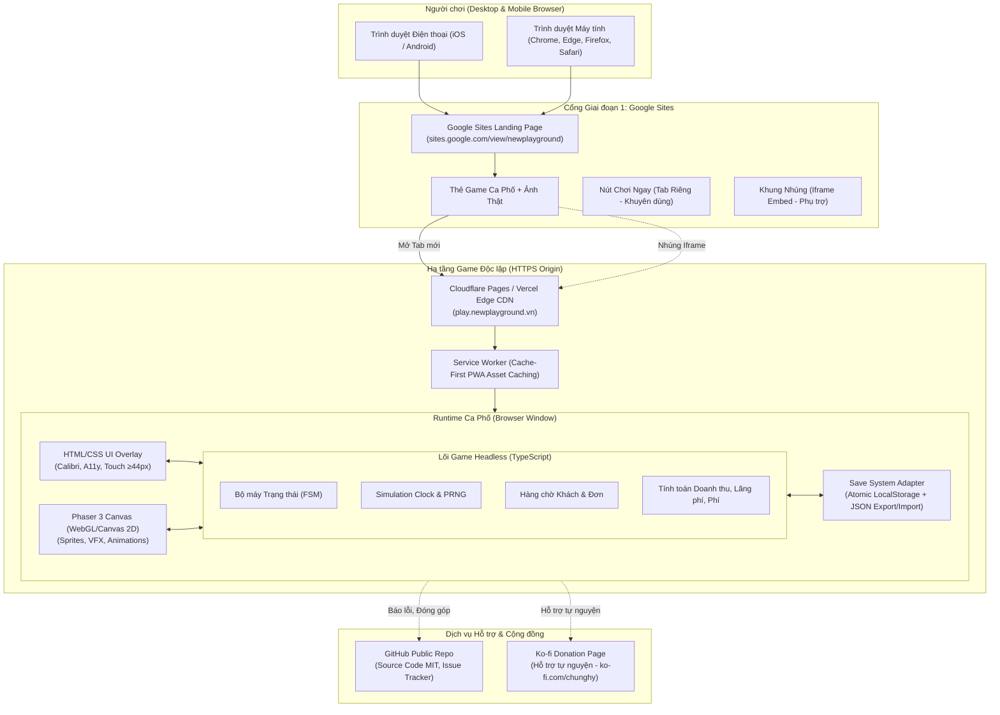
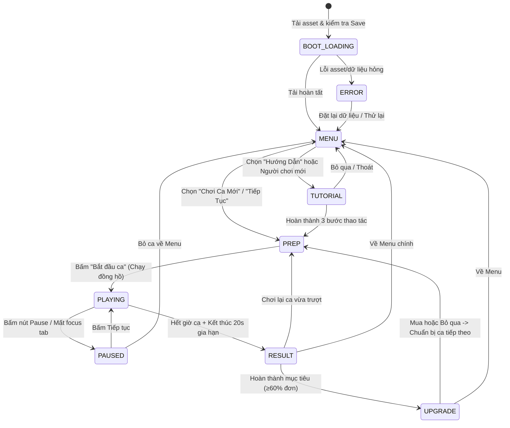
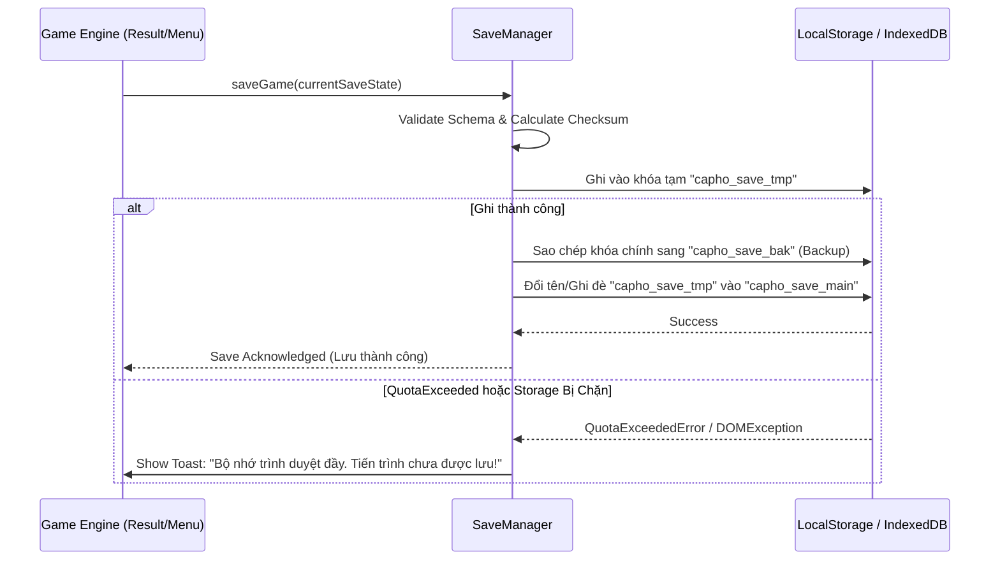
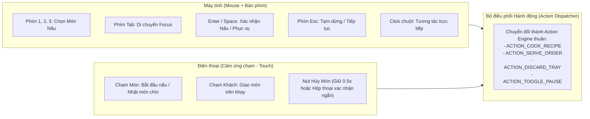
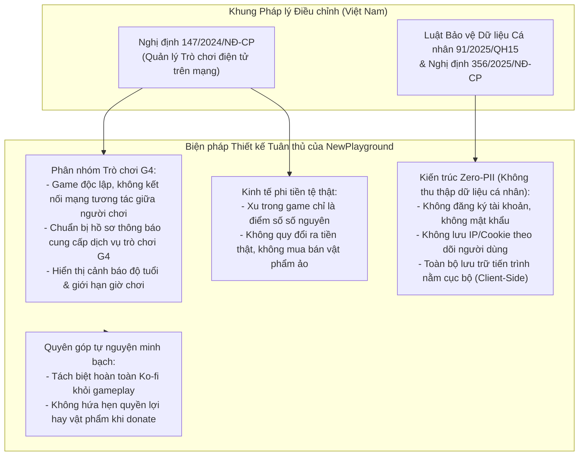
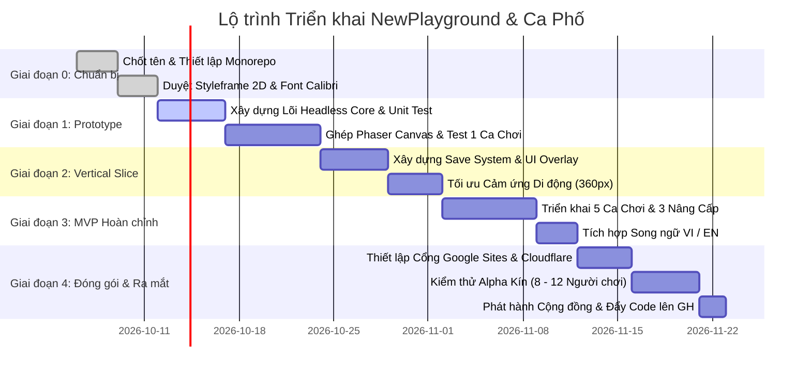

# KIẾN TRÚC KỸ THUẬT TOÀN DIỆN (SYSTEM ARCHITECTURE)
## DỰ ÁN: NEWPLAYGROUND (PHIÊN BẢN 1.0)
**Trò chơi thử nghiệm đầu tiên:** Ca Phố (Corner Shift)
**Tiêu chuẩn văn bản:** Font Calibri, chuẩn hóa hiển thị đa nền tảng, thiết kế rõ ràng và chuyên nghiệp.

---

## 1. TỔNG QUAN TẦM NHÌN & NGUYÊN TẮC THIẾT KẾ

NewPlayground là nền tảng tuyển chọn và phát hành các trò chơi web nhỏ gọn, miễn phí, chơi trực tiếp trên trình duyệt máy tính và điện thoại. Dự án tái hiện cảm giác hoài niệm thông qua nhịp điệu và lối chơi gần gũi, nhưng xây dựng bằng 100% tài nguyên và bản sắc nguyên bản, không sao chép hay xâm phạm quyền sở hữu trí tuệ của bất kỳ tựa game nào trong quá khứ.

### 4 Nguyên tắc cốt lõi (Core Principles)
1. **Client-First & Zero-Friction (Ưu tiên phía máy khách & Không rào cản):**
   Vào chơi ngay lập tức trong 1 click. Không bắt buộc đăng nhập, không tải app, không thu thập thông tin định danh (PII). Game tải siêu tốc (< 5 MB nén) và có thể chạy offline sau lần tải đầu.
2. **Headless Simulation Engine (Tách biệt lõi mô phỏng khỏi hiển thị):**
   Toàn bộ luật chơi, tính toán kinh tế, hàng chờ khách và thời gian được đóng gói thành một thư viện thuần TypeScript (Pure Engine), không dính líu đến Phaser Canvas hay DOM. Cho phép viết kiểm thử tự động (Unit Test) đạt độ bao phủ 100% và mô phỏng hàng triệu lượt chơi chỉ trong vài giây.
3. **Hybrid View (Giao diện lai Canvas + HTML Semantic):**
   Phaser 3 chịu trách nhiệm vẽ thế giới game (quầy hàng, hoạt cảnh nấu nướng, khách hàng di chuyển), trong khi HTML5/CSS overlay chịu trách nhiệm hiển thị HUD, văn bản hướng dẫn, bảng nâng cấp và menu để đạt chuẩn tiếp cận (a11y), phông chữ Calibri sắc nét trên màn hình Retina và chuẩn kích thước chạm trên mobile (≥ 44px).
4. **Data Sovereignty & Safe Persistence (An toàn dữ liệu cục bộ):**
   Lưu tiến trình nguyên tử (Atomic Local Save) có kiểm tra tính toàn vẹn (checksum/schema validation), tự động di chuyển phiên bản (migration), cơ chế khôi phục khi lỗi (fallback snapshot) và hỗ trợ xuất/nhập tệp JSON thủ công.

---

## 2. KIẾN TRÚC TỔNG THỂ HỆ THỐNG (SYSTEM TOPOLOGY)



---

## 3. CƠ CẤU MÃ NGUỒN (MONOREPO ARCHITECTURE)

Dự án áp dụng cấu trúc **Monorepo (pnpm workspaces + Turborepo)** để chia sẻ logic giữa các game tương lai, chuẩn hóa công cụ build và tách bạch dữ liệu nội dung với engine.

```
newplayground/
├── apps/
│   ├── portal/                   # [Phase 2] Cổng website tĩnh (Astro/Next.js)
│   └── game-capho/               # Ứng dụng game Ca Phố (Phaser 3 + Vite + TypeScript)
│       ├── public/
│       │   ├── assets/
│       │   │   ├── atlases/      # Sprite sheets & JSON atlas (TexturePacker)
│       │   │   ├── audio/        # SFX (m4a/mp3) & Nhạc nền (WebP/Opus tối ưu)
│       │   │   └── fonts/        # Web fonts (Calibri/Inter WOFF2)
│       │   ├── favicon.ico
│       │   └── manifest.json     # PWA Manifest
│       ├── src/
│       │   ├── scenes/           # BootScene, MenuScene, PlayScene, ResultScene
│       │   ├── ui/               # DOM Controller, HUD Overlay, Modal Dialogs
│       │   ├── audio/            # AudioManager (Web Audio unlock & SFX bus)
│       │   ├── bridge/           # Cầu nối giữa Phaser Scene và Headless Core
│       │   ├── main.ts           # Game Bootstrap & Phaser Config
│       │   └── style.css         # UI CSS (Typography Calibri, Safe Area)
│       ├── index.html
│       ├── vite.config.ts
│       └── tsconfig.json
├── packages/
│   ├── core/                     # Lõi logic không phụ thuộc canvas/DOM
│   │   ├── src/
│   │   │   ├── engine/           # CaPhoEngine, GameLoop, VirtualClock
│   │   │   ├── fsm/              # StateMachine (BOOT -> MENU -> PLAYING...)
│   │   │   ├── economy/          # Công thức tài chính, doanh thu, lãng phí
│   │   │   ├── entities/         # Customer, Order, CookingSlot, Tray
│   │   │   ├── prng/             # Mulberry32 PRNG (hỗ trợ seed để tái lập)
│   │   │   └── types/            # Định nghĩa Interface & Event Types
│   │   ├── tests/                # Unit test mô phỏng toàn bộ lượt chơi
│   │   ├── package.json
│   │   └── tsconfig.json
│   ├── content/                  # Cấu hình dữ liệu trò chơi & ngôn ngữ
│   │   ├── src/
│   │   │   ├── shifts.ts         # Cấu hình 5 ca chơi (thời gian, khách, món)
│   │   │   ├── recipes.ts        # 3 món: thời gian nấu, giá bán, chi phí
│   │   │   ├── customers.ts      # 3 loại khách: thời gian kiên nhẫn, hành vi
│   │   │   ├── upgrades.ts       # 3 nâng cấp: khay thêm, nấu nhanh, biển hiệu
│   │   │   └── i18n/             # Bộ từ điển song ngữ Tiếng Việt & Tiếng Anh
│   │   │       ├── vi.json
│   │   │       ├── en.json
│   │   │       └── index.ts
│   │   ├── package.json
│   │   └── tsconfig.json
│   └── save-system/              # Thư viện lưu trữ tiến trình an toàn
│       ├── src/
│       │   ├── schema.ts         # SaveData JSON Schema & Type Validators
│       │   ├── adapter.ts        # StorageAdapter (LocalStorage / MemoryFallback)
│       │   ├── migrations.ts     # Pipeline nâng cấp phiên bản dữ liệu lưu
│       │   └── manager.ts        # SaveManager (Atomic write, Checksum, Export/Import)
│       ├── package.json
│       └── tsconfig.json
├── docs/                         # Tài liệu kiến trúc, hướng dẫn đóng góp, pháp lý
├── .github/
│   └── workflows/
│       ├── ci.yml                # CI: Lint, TypeCheck, Unit Test, Build
│       └── deploy.yml            # Tự động xuất bản lên Cloudflare Pages
├── pnpm-workspace.yaml
├── turbo.json
├── package.json
├── LICENSE                       # Giấy phép MIT cho mã nguồn
└── ASSET_LICENSES.md             # Bảng kê nguồn gốc và bản quyền tài sản
```

---

## 4. THIẾT KẾ CHI TIẾT LÕI MÔ PHỎNG (HEADLESS SIMULATION CORE)

### 4.1. Máy trạng thái hữu hạn (Finite State Machine - FSM)



### 4.2. Khung thời gian mô phỏng (Simulation Clock vs Wall Clock)
- **Đồng hồ ảo (Virtual Tick):** Không sử dụng `Date.now()` để tính thời gian kiên nhẫn hay nấu nướng. Engine nhận `deltaMs` từ vòng lặp chính:
  $$\text{simTime} = \text{simTime} + \Delta t$$
- **Chống gian lận & Chống trừng phạt khi ẩn tab:**
  Khi trình duyệt kích hoạt sự kiện `visibilitychange` (`document.hidden === true`), hệ thống chuyển tức thì sang trạng thái `PAUSED`. Khách hàng không bị mất kiên nhẫn khi người chơi có điện thoại hay chuyển tab.

### 4.3. Mô hình dữ liệu & Công thức tính toán kinh tế

```typescript
export interface Recipe {
  id: string;
  nameKey: string;
  cookTimeMs: number;       // Món 1: 4000ms | Món 2: 7000ms | Món 3: 10000ms
  price: number;            // 12 | 18 | 25 xu
  ingredientCost: number;   // 4 | 7 | 10 xu
}

export interface CustomerType {
  id: string;
  nameKey: string;
  patienceMs: number;       // 35000ms | 45000ms | 55000ms
  spawnWeight: number;      // Tỉ lệ xuất hiện
}

export interface ShiftConfig {
  shiftNumber: number;      // 1 đến 5
  durationSeconds: number;  // 180s
  gracePeriodSeconds: number; // 20s gia hạn
  availableRecipes: string[];
  customerTypes: string[];
  spawnIntervalRange: [number, number]; // [10000, 14000] ms
  stallFee: number;         // Ca 1: 0 xu | Ca 2-5: tăng dần
  minServiceRate: number;   // 0.60 (60% đơn đúng để qua màn)
}
```

**Công thức kết quả ca chơi:**
$$\text{Lợi nhuận ròng} = \sum (\text{Giá đơn đúng}) - \sum (\text{Chi phí nguyên liệu đã dùng}) - \text{Phí quầy}$$
$$\text{Tỷ lệ phục vụ (\%)} = \frac{\text{Số đơn phục vụ đúng}}{\text{Tổng số đơn khách đã đặt}} \times 100\%$$
$$\text{Lãng phí} = \sum (\text{Chi phí nguyên liệu của món bị vứt bỏ})$$

---

## 5. THIẾT KẾ HỆ THỐNG LƯU TRỮ TIẾN TRÌNH (ATOMIC SAVE SYSTEM)

### 5.1. Cấu trúc Schema bản lưu (Save Schema v1.0)
Dữ liệu lưu trữ được chuẩn hóa theo định dạng JSON với schema rõ ràng:

```typescript
export interface SaveDataV1 {
  schemaVersion: 1;
  buildVersion: string;         // e.g. "1.0.0-beta.1"
  savedAt: string;              // ISO-8601 Timestamp
  unlockedShift: number;        // Ca cao nhất đã mở (1 - 5)
  completedShifts: number[];    // Danh sách ca đã hoàn thành
  coins: number;                // Số tiền hiện có (số nguyên >= 0)
  upgrades: {
    extraTray: boolean;         // Mở khay chứa thứ 3 (60 xu)
    fastCook: boolean;          // Giảm 20% thời gian nấu (80 xu)
    signboard: boolean;         // Tăng 10% kiên nhẫn khách (50 xu)
  };
  bestResults: Record<number, {
    profit: number;
    serviceRate: number;
    waste: number;
  }>;
  settings: {
    masterVolume: number;       // 0.0 - 1.0
    sfxVolume: number;          // 0.0 - 1.0
    bgmVolume: number;          // 0.0 - 1.0
    language: 'vi' | 'en';
    reducedMotion: boolean;
  };
  tutorialCompleted: boolean;
  checksum: string;             // SHA-256 hoặc CRC32 băm nội dung để phát hiện can thiệp
}
```

### 5.2. Quy trình ghi nguyên tử (Atomic Write Sequence)



### 5.3. Chiến lược đối phó rào cản Iframe (Storage Partitioning Mitigation)
Do các trình duyệt hiện đại (Safari ITP, Chrome CHIPS) tự động phân vùng (partition) `localStorage` của iframe nhúng trong Google Sites:
- Tại màn hình khởi động (Boot), game kiểm tra:
  ```typescript
  const isInIframe = window.self !== window.top;
  ```
- Nếu `isInIframe === true`:
  Hiển thị thông báo nhỏ, trang nhã: *"Bạn đang chơi ở chế độ nhúng. Trình duyệt có thể không đồng bộ dữ liệu khi bạn mở ở tab riêng. Nhấn [Mở Tab Riêng] để lưu vĩnh viễn."*
- Cung cấp tính năng **"Sao lưu / Khôi phục tệp JSON"** trực tiếp trong phần Cài đặt để người chơi có thể tải file `.json` về máy hoặc paste chuỗi mã hóa để mang tiến trình sang thiết bị khác mà không cần backend!

---

## 6. GIAO DIỆN LAI (HYBRID UI), ĐIỀU KHIỂN & TRỢ NĂNG (A11Y)

### 6.1. Phân tách nhiệm vụ hiển thị

| Hạng mục | Công nghệ | Trách nhiệm hiển thị |
| :--- | :--- | :--- |
| **Thế giới trò chơi (Game Canvas)** | Phaser 3 (WebGL/Canvas) | Khung cảnh góc phố, quầy hàng, khay thức ăn, hoạt cảnh chiên nấu khói lửa, biểu cảm khách hàng (đến, đợi, nhận món, rời đi). Tỷ lệ hiển thị tự co giãn theo tỉ lệ cố định `16:9` hoặc `4:3` bằng Phaser Scale Manager (`FIT`). |
| **Giao diện điều khiển (UI Overlay)** | HTML5 + CSS3 (Flexbox/Grid) | Thanh HUD (thời gian, tiền), 3 nút bấm chọn món, nút hủy món, modal Menu, kết quả ca, nâng cấp. **Áp dụng triệt để font chữ Calibri**, cỡ chữ tối thiểu 16px, đảm bảo độ tương phản màu chuẩn WCAG AA (≥ 4.5:1). |

### 6.2. Ma trận điều khiển (Input Matrix)



- **Quy tắc nút bấm trên di động:** Toàn bộ diện tích chạm (Hitbox) đạt tối thiểu **$44 \times 44\text{ CSS px}$**, khoảng cách giữa các nút bấm tối thiểu $8\text{ px}$ nhằm triệt tiêu hoàn toàn hiện tượng bấm nhầm khi chơi ở nhịp độ cao.
- **Trợ năng người khiếm thị / giảm thính lực:**
  - Không dựa duy nhất vào âm thanh: Khách sắp hết kiên nhẫn sẽ có thanh thời gian đổi trạng thái, biểu cảm nhăn mặt và hiệu ứng rung nhẹ (nếu không bật `reduced-motion`).
  - Hỗ trợ đầy đủ cờ `prefers-reduced-motion` trong CSS media query.

---

## 7. MỸ THUẬT, ÂM THANH & BẢN QUYỀN TÀI NGUYÊN (ASSET PIPELINE)

### 7.1. Định hướng mỹ thuật (Art Direction)
- **Phong cách chủ đạo:** Đồ họa 2D minh họa phẳng hiện đại (Contemporary Editorial Illustration), hình khối sạch sẽ, góc nhìn chính diện quầy hàng (Straight-on Counter Perspective).
- **Hệ màu chuẩn (Color Palette):**
  - Màu nền chủ đạo: Trắng ngà / Kem giấy báo cũ (`#F8F6F0`).
  - Màu chữ & đường nét: Than chì đậm (`#2B2D42`).
  - Màu bổ trợ nhận diện: Xanh dương đô thị (`#1D3557`).
  - Màu điểm nhấn món ăn & tương tác: Cam lửa ấm (`#E76F51`) và Vàng nghệ (`#F4A261`).
- **Nói không với:** Đồ họa AI méo mó thiếu nhất quán, chi tiết 3D giả lập bóng bẩy, nhân vật em bé hoạt họa rẻ tiền, hoặc việc lạm dụng cờ/biểu tượng quốc gia phản cảm.

### 7.2. Quản lý âm thanh (Web Audio Strategy)
- Trình duyệt hiện đại (đặc biệt là iOS Safari) chặn toàn bộ âm thanh tự phát (Autoplay Policy).
- **Bộ mở khóa âm thanh (Audio Unlocker):**
  Lắng nghe sự kiện chạm đầu tiên của người dùng (`pointerdown` trên nút "Bắt đầu" tại Menu) để khởi tạo và resume `AudioContext`.
- Tách biệt hai kênh điều khiển riêng:
  1. Kênh hiệu ứng âm thanh (SFX Bus): Âm xèo xèo khi đặt món lên chảo, tiếng leng keng của tiền xu, tiếng chuông phục vụ đúng.
  2. Kênh nhạc nền (BGM Bus): Nhạc lofi/acoustic phố phường êm dịu, âm lượng mặc định ở mức vừa phải (50%) và có nút Mute ngay trên màn hình chính.

### 7.3. Phân tách giấy phép & Danh mục tài sản (IP & Asset Clearance)
- **Mã nguồn (Source Code):** Giấy phép mã nguồn mở **MIT License** trong file `LICENSE`.
- **Tài sản nghe nhìn (Art, Audio, Fonts):** Toàn bộ nằm trong danh mục `ASSET_LICENSES.md`:
  - Font chữ: Calibri (hệ thống/web-safe) hoặc Inter / Be Vietnam Pro (OFL - Open Font License).
  - Sprite & Hoạt họa: Bản quyền thuộc NewPlayground Team hoặc CC-BY 4.0 ghi công tác giả rõ ràng.
  - Âm thanh: Tự thu âm hoặc giấy phép CC0 / Freesound thương mại hợp pháp.
  - **Tuyệt đối không sử dụng:** Tên gọi, logo, hình vẽ hay tệp âm thanh trích xuất từ trò chơi "Hàng Rong" hoặc bất kỳ game flash cũ nào.

---

## 8. PHÁP LÝ & AN TOÀN DỮ LIỆU TẠI VIỆT NAM



---

## 9. QUY TRÌNH KIỂM THỬ & TIÊU CHÍ NGHIỆM THU (QA & ACCEPTANCE MATRIX)

### 9.1. Ma trận kiểm thử tự động & thủ công

```
                      +---------------------------------------+
                      |        E2E Tests (Playwright)         |
                      |  - Khởi động, hoàn thành 1 ca         |
                      |  - Kiểm tra lưu & phục hồi tiến trình |
                      |  - Responsive 360px & xoay màn hình   |
                      +---------------------------------------+
                                          ▲
                                          │
                      +---------------------------------------+
                      |     Integration Tests (Phaser/DOM)    |
                      |  - Cầu nối Action <-> Scene           |
                      |  - Nhận input touch/keyboard chuẩn    |
                      |  - Âm thanh mở khóa sau user gesture  |
                      +---------------------------------------+
                                          ▲
                                          │
                      +---------------------------------------+
                      |       Core Unit Tests (Vitest)        |
                      |  - 100% Logic kinh tế, công thức      |
                      |  - FSM chuyển đổi trạng thái hợp lệ   |
                      |  - Chống tiền âm, chống nhân bản đĩa  |
                      |  - Seeded PRNG tái lập 100% lượt chơi |
                      +---------------------------------------+
```

### 9.2. Phân loại lỗi và Tiêu chuẩn chặn phát hành (Release Gates)
- **Lỗi nghiêm trọng cấp độ 0 (P0 - Blocker):**
  - Mất dữ liệu lưu cục bộ khi tải lại trang.
  - Tiền xu hoặc số lượng nguyên liệu bị âm.
  - Game vỡ giao diện hoặc không thể thao tác trên màn hình điện thoại $360 \times 800\text{ px}$.
  - Vi phạm bản quyền hình ảnh hoặc âm thanh.
  $\rightarrow$ **Quyết định:** Chặn tuyệt đối việc phát hành.
- **Lỗi cấp độ 1 (P1 - Critical):**
  - Không thể hoàn thành ca chơi do nghẽn hàng chờ.
  - Phím tắt bàn phím không hoạt động.
  - Nút Ko-fi che khuất giao diện chơi.
  $\rightarrow$ **Quyết định:** Bắt buộc sửa chữa trước khi gắn tag Release.

---

## 10. LỘ TRÌNH TRIỂN KHAI VÀ GIẢI ĐÁP QUYẾT ĐỊNH (FOUNDER ROADMAP)

### 10.1. Đề xuất giải pháp cho 5 câu hỏi cốt lõi của Người sáng lập

| STT | Vấn đề người sáng lập cần chốt | Khuyến nghị kiến trúc sư | Căn cứ kỹ thuật & vận hành |
| :---: | :--- | :--- | :--- |
| **1** | **Có chọn Ca Phố làm prototype đầu tiên không?** | **CHỐT CHỌN CA PHỐ.** | Vòng lặp 3 phút rất vừa vặn cho web game, luật chơi phục vụ quầy hàng dễ hiểu, kiểm chứng hoàn hảo tương tác chạm và lưu trữ trước khi mở rộng. |
| **2** | **Nên chọn 2D minh họa hay Pixel Art?** | **CHỌN 2D MINH HỌA PHẲNG (Editorial 2D).** | Pixel art đòi hỏi xử lý tỉ mỉ để không bị vỡ hạt (blur/pixel distortion) khi scale trên các tỷ lệ màn hình điện thoại đa dạng. 2D vector/minh họa phẳng giữ độ sắc nét hoàn hảo trên cả màn Retina và tiết kiệm thời gian hoàn thiện UI. |
| **3** | **Ai chịu trách nhiệm pháp lý và ngân sách?** | **NGƯỜI SÁNG LẬP (CÁ NHÂN / HỘ KINH DOANH).** | Giai đoạn thử nghiệm chạy với tư cách dự án độc lập (indie project), ngân sách duy trì hạ tầng $0 (tận dụng gói miễn phí của Cloudflare Pages và Google Sites). Khi có doanh thu đóng góp hoặc mở rộng, tiến hành đăng ký pháp nhân. |
| **4** | **Có tách giấy phép MIT (Code) và Bản quyền (Art) không?** | **ĐỒNG Ý TÁCH BIỆT.** | Code là công cụ chia sẻ cộng đồng (MIT), nhưng nhận diện thương hiệu, hình ảnh góc phố, nhân vật và âm thanh phải giữ bản quyền để bảo vệ giá trị độc bản của NewPlayground. |
| **5** | **Khi nào và bằng cách nào xác minh Ko-fi?** | **XÁC MINH TRƯỚC KHI BẬT NÚT DONATE.** | Hiện tại chưa kết nối cổng thanh toán thì **tuyệt đối không hiển thị nút donate**. Chỉ đặt nút sau khi người sáng lập hoàn tất kết nối PayPal/Stripe cá nhân và thử nghiệm giao dịch nhận tiền thành công. |

### 10.2. Lộ trình 5 giai đoạn phát triển (Milestones)



---
*Tài liệu kiến trúc này là khung tham chiếu kỹ thuật chính thức cho toàn bộ quá trình lập trình và triển khai của NewPlayground.*
