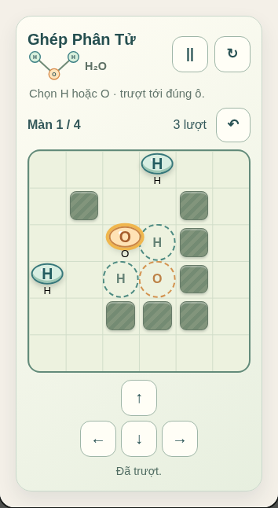

# Ghép Phân Tử — local playtest record

Date: 2026-10-09. Environment: repository static site, headless Chromium, phone-sized touch emulation at 390px and 320px, then a 1280px desktop viewport.

The browser walkthrough selected H/O atoms by touch, slid using both arrow keys and the on-screen pad, checked pause/resume, restart and undo, then solved every authored H₂O board and started a fresh campaign. It checked three distinct goal cells, the wall/atom stops, at-least-44px touch targets at both phone widths, no horizontal overflow and a wider desktop board; close/reopen released the old session without browser errors.

Each board has a locally tested shortest witness route of 6, 8, 10 and 12 glides. The model/unit suite also checks invalid input, blocked movement, terminal guarding, progression and page-interruption pause.

Automated results:

- `node --test tests/atom-glide-model.test.cjs tests/atom-glide-ui.test.cjs`: **9 passed**.
- Targeted Playwright: **1 passed** (touch, keyboard, all four wins, replay and responsive sizes).
- Full repository Node suite: `node --test tests/*.test.cjs` — **1,202 passed, 0 failed**.
- Full Chromium suite: **29 passed, 0 failed**, including all 56 registered routes.
- Static release preflight passed for 150 catalog entries, 56 launcher engines, 94 planned entries, 137 declared assets, 1,750,810 source-JavaScript bytes and 19,880,087 asset bytes.

This is local Chromium evidence only. Physical-device movement feel, human rule comprehension, assistive-technology behavior and title/route/distribution rights remain pending.
