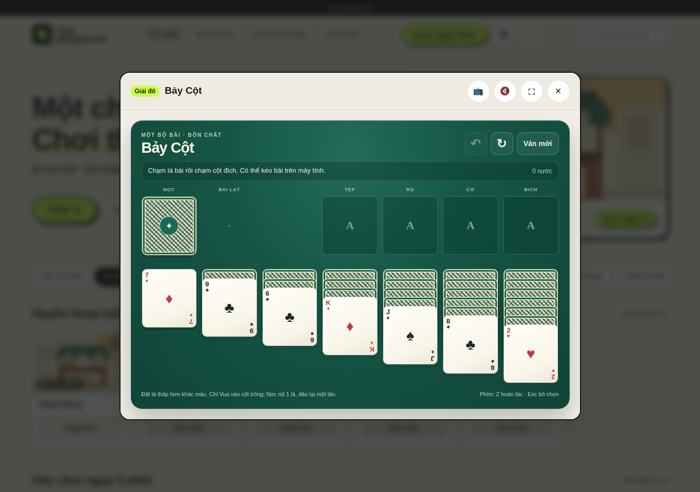
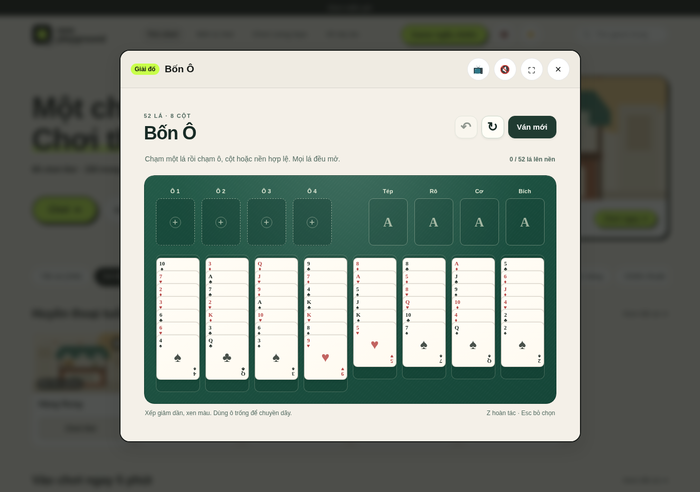
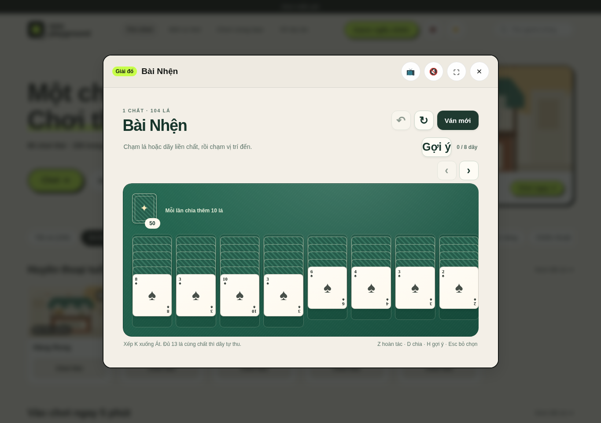
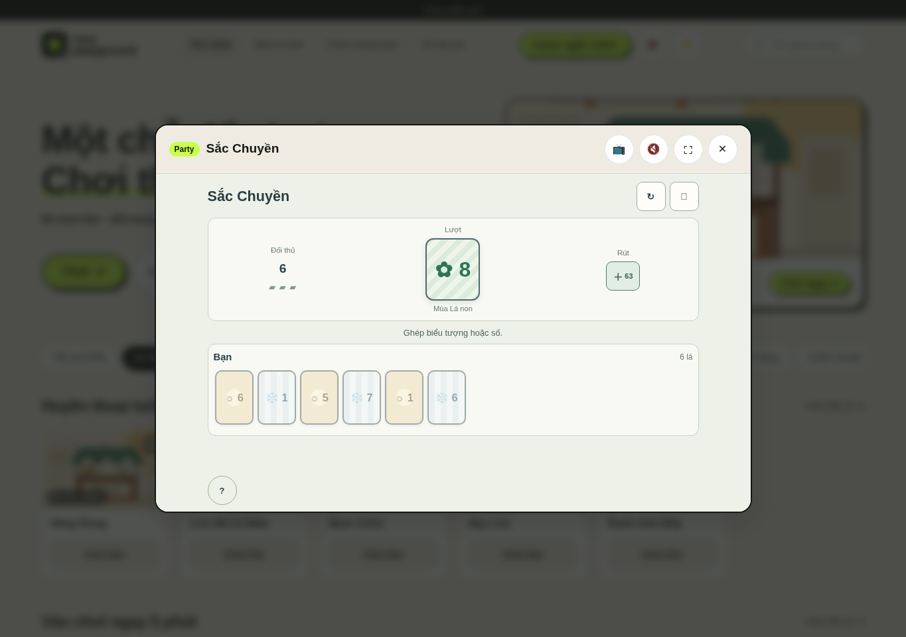

# Four card games: deep gameplay check

Date: 2026-10-09 UTC  
Checkout: `codex/quality-depth-integration-20261009`  
Browser: Chromium, 1365 × 960 desktop screenshots; 320 × 800 mobile Playwright checks.

## Results

The chosen variants and board layouts match their local research docs and the relevant rule sources. The live browser run exercised real route opening and controls; no page errors, console errors, or failed same-origin requests occurred. The test pass did not find a reproducible rules defect, so it changes no game model.

Two missing terminal-state regressions are now covered: FreeCell undo/restart after a stuck board, and Spider undo/restart after the last stock row produces a stuck board. Existing behavior tests already cover Klondike's deterministic win and no-moves loss, FreeCell's complete foundation win, Spider's run removal and exhausted-stock loss, and Sắc Chuyền wins by either player.

| Game | Live browser sequence | Terminal and recovery evidence | Undo |
|---|---|---|---|
| Bảy Cột | Deal a card; Undo restores the move count; deal again; Restart restores zero moves. | `tests/klondike-model.test.cjs`: deterministic complete win, no-moves loss, Undo and same-deal Restart. | Supported |
| Bốn Ô | Select an exposed card; move it to a free cell; Undo clears the cell; Restart restores four empty cells. | `tests/freecell-model.test.cjs`: deterministic full win and a seed-2 stuck state, rejected post-terminal move, Undo and Restart. | Supported |
| Bài Nhện | Ask for a hint; tap its target; Undo; Restart. | `tests/spider-model.test.cjs`: completed run and seed-526 exhausted-stock stuck state, Undo/redeal and Restart. | Supported |
| Sắc Chuyền | Try an enabled legal card or draw; confirm “Ván mới?”; Restart returns to a six-card hand. | `tests/season-shed-model.test.cjs`: player and AI round wins, terminal action rejection, discard recycling, save/restore. | No undo control in this original 1v1 scope; restart is confirmed and tested. |

Sắc Chuyền intentionally uses a custom 76-card, six-card-hand duel documented in [its scope](../games/SEASON_SHED_RESEARCH_AND_SCOPE.md); it is not claiming Mattel UNO rules. Its current design exposes Restart and Pause, not Undo. No undo feature was added because the reviewed scope makes no undo promise and an undo after observing an AI response would change the duel's rules.

## Screenshots and reproduction

These screenshots were captured from the running portal in Chromium, not from DOM doubles:

Reproduce the short UI sequences by opening each catalog route, then:

1. **Bảy Cột:** press the stock, Undo, press the stock again, then Restart. The move counter returns `0 → 1 → 0 → 1 → 0`.
2. **Bốn Ô:** select the bottom card in column 1, select free cell 1, Undo, Restart. The cell fills, clears, and the board returns to its original deal.
3. **Bài Nhện:** press Gợi ý, tap the suggested target column, Undo, Restart. The same tap-based move and recovery work on a narrow touch viewport too.
4. **Sắc Chuyền:** choose an enabled card if available (otherwise draw), let the opponent respond, then press the new-game control and confirm. The duel returns to six cards per side.

The deterministic terminal paths are executable in the tests named above. For example, the exact legal move sequence that makes FreeCell seed 2 stuck is encoded in the new test `a stuck position rejects moves, then undo and restart recover the deal`; the Spider stuck path is encoded in `an exhausted stuck position rejects hints and recovers through undo or restart`.

## Checks run

- Baseline focused tests: 61 passed, 0 failed. After the additions, the focused four-game model/UI pack passed 62/62.
- Full Node suite: 1,273 passed, 0 failed.
- Full Chromium suite: 37 passed, 0 failed. This includes live 320 × 800 mobile checks for all four card games. The separate desktop interaction run also exercised selection/moves, undo, restart, and card draw; zero browser errors were recorded.
- `node scripts/release-preflight.mjs --prepare`: passed with 150 catalog entries, 60 playable prototypes, 90 planned entries, and 137 declared asset files. The preflight checks static consistency and syntax, not gameplay.

These checks establish interaction and deterministic rules behavior, not a human win rate, solver-backed solvability for random deals, screen-reader certification, or physical-device acceptance.
