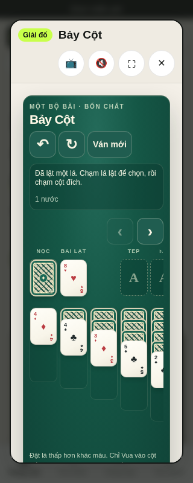
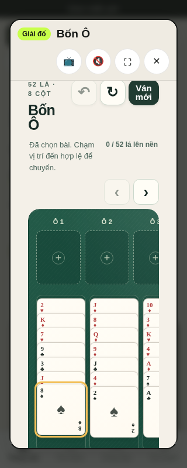
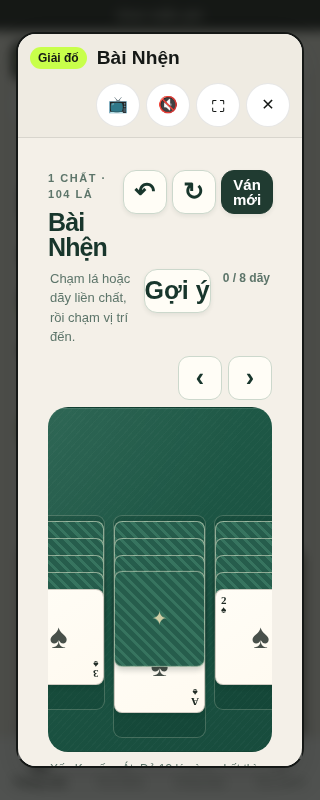
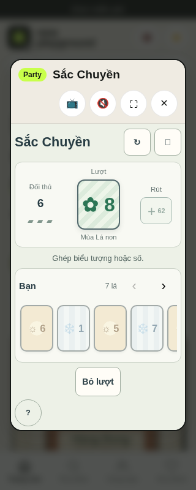

# Mobile card-game playtest — 9 October 2026

## Scope and baseline

Playwright 1.63.0 with Chromium 151, a 320 × 800 touch-emulated viewport, and the prepared static site. The four games were tested before and after their mobile navigation changes. The eight model/UI suites passed **61/61** tests before edits.

Before the changes, Bảy Cột rendered its first card button at **42 × 61 px**; its full game surface scrolled horizontally at 352 px inside a 242 px viewport. Bốn Ô's 748 px board and Bài Nhện's 1,030 px board both relied on gesture scrolling alone. Sắc Chuyền's six-card hand spanned 358 px inside a 258 px window; the game remained playable by drawing when the initial hand had no legal match.

Baseline touch actions worked: stock draw in Bảy Cột, exposed-card selection in Bốn Ô, a legal hint in Bài Nhện, and drawing in Sắc Chuyền.

## Changes

- Bảy Cột now keeps the game header and status inside the viewport, scrolls only the card board, and enforces a 44 px minimum card width. Three games with wide boards now show left/right 44 px pan buttons only while their boards overflow; the buttons respect reduced motion and disappear when the board fits.
- Sắc Chuyền now exposes the hidden part of its hand with 44 px pan buttons and labels the hand as horizontally scrollable for keyboard and assistive-technology users.
- Pan handlers are owned by the active game session, so closing a game removes their click, scroll, and resize listeners.

## After-play evidence

At 320 × 800, all four pages fit the viewport without document-level horizontal overflow. The Bảy Cột card button measures **44 × 61 px**. Touch navigation moved each overflowing board/hand in both directions; gameplay then drew from the Klondike stock, selected a FreeCell card, applied a hinted Spider move, and drew a Sắc Chuyền card. The browser reported no page or console errors.

After the changes, the full Node suite passed **1,272/1,272**, the full Chromium suite passed **37/37**, and the four focused mobile game tests passed **4/4**. Static release preflight passed with 150 catalog entries, 60 playable prototypes, and 90 planned entries.

| Bảy Cột | Bốn Ô |
| --- | --- |
|  |  |

| Bài Nhện | Sắc Chuyền |
| --- | --- |
|  |  |

This is Chromium mobile emulation, not physical iOS/Android acceptance. Screen-reader output, physical-device gestures, novice comprehension, and legacy-name/distribution-rights review remain untested.
