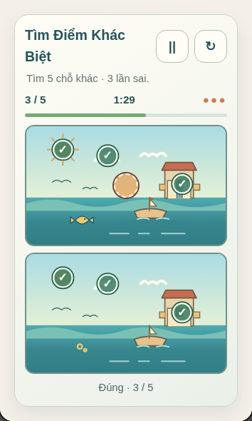
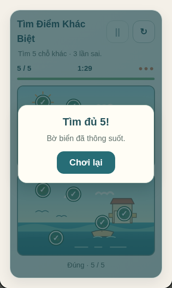
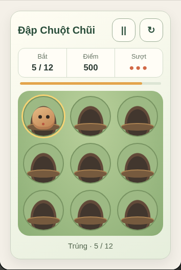
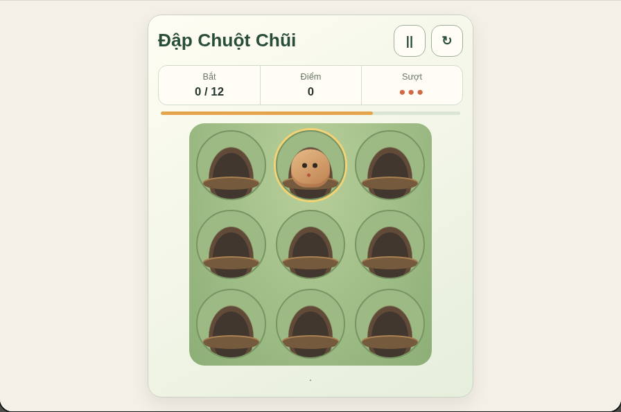

# P3 game discovery — integration playtest

Date: 2026-10-09. Scope: `tim-diem-khac-biet` and `dap-chuot-chui`, launched through the real catalog and `NP_GameSession` in headless Chromium with mobile touch emulation.

## What was exercised

- `Tìm Điểm Khác Biệt`: found authored SVG targets by touch and by keyboard cursor, marked both images, paused/resumed, won and replayed, lost on three misses, then reopened at desktop width. The pair reflows from a stacked 390 × 844 layout to two columns at 1024 px.
- `Đập Chuột Chũi`: caught targets by number key, focused-button Space and touch; paused/resumed, reached the 12-hit win, checked score/replay, and reopened at 1280 × 900. The mobile 390 × 844 board stays within the viewport and retains 68 px minimum holes.
- The app opens and closes both exact routes through the catalog. Session close removes the new view and its animation frame/listeners; unit coverage also dispatches hidden-page interruption and checks that the round pauses rather than advancing.
- Compared computed mole-game colors and pause glyph in Chromium to catch collisions with the existing Marble Trail `.mt-*` CSS family. The new game uses its own `.mole-*` namespace.

## Evidence

The following screenshots are from touch-emulated Chromium after real browser input. They document 3/5 differences, the completed comparison, a live mole round and its desktop layout.

| In-play comparison, mobile | Completed comparison, mobile |
| --- | --- |
|  |  |

| Live mole round, mobile | Mole board, desktop |
| --- | --- |
|  |  |

## Checks

- `node --test tests/*.test.cjs`: **1184 passed, 0 failed**.
- Dedicated new-game model and UI tests: `node --test tests/mole-tap-model.test.cjs tests/mole-tap-ui.test.cjs tests/spot-difference-model.test.cjs tests/spot-difference-ui.test.cjs`: **18 passed, 0 failed**.
- `node scripts/release-preflight.mjs --prepare`: **passed**, reporting 150 catalog items, 54 playable prototypes, 96 planned entries, 137 declared asset files.
- Playwright 1.63.0 / Chromium 151: **27/27 passed** from `tests/browser/portal.spec.cjs`, including opening and cleanup of all 54 routes, the two new win/replay loops, input, pause, mobile layout and wide reflow.

## Limits

Chromium touch emulation is not a physical-device or Safari test. This pass does not claim testing by new players, screen-reader users, or reduced-motion users on hardware. The historic catalog names and any release-specific/trademark rights remain outside this prototype's clearance; there is no claim of parity with a named edition. Human difficulty/balance review is still needed.

All new visual assets are authored in-repository: two hand-written coastal SVGs and CSS geometry for the mole board. No third-party art, audio, font, network-hosted asset or external runtime dependency was added.
