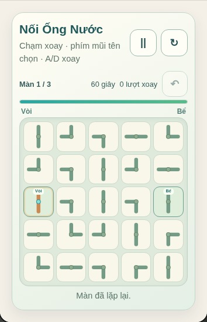

# Nối Ống Nước — local playtest record

Date: 2026-10-09. Environment: repository static build, local headless Chromium, 390px touch emulation, then 320px and 1280px viewports.

The browser test opened the exact catalog route, verified the descriptive modal title and 25 pipe buttons, rotated with keyboard, undid the move, paused and confirmed pressure stayed fixed for 1.1 seconds, resumed, restarted, then routed water through each of the three authored stages using the visible touch controls. It replayed a new campaign, resized to 320px and desktop, checked 44px-or-larger pipe targets and no horizontal document overflow, and closed each session without browser errors.

Automated results:

- `node --test tests/pipe-route-model.test.cjs tests/pipe-route-ui.test.cjs`: **9 passed**.
- Targeted Playwright: `playwright test --grep 'Nối Ống Nước routes'`: **1 passed** (all three stages, touch/keyboard, pause, undo, retry/replay and sizes).
- Full repository Node suite: `node --test tests/*.test.cjs` — **1,202 passed, 0 failed**.
- Full Chromium suite: **29 passed, 0 failed**, including route-open/render/close for all 56 registered games.
- `node scripts/release-preflight.mjs --prepare`: passed static catalog/registry/script/style/asset validation; 150 catalog entries, 56 playable prototypes, 94 planned entries.

The screenshot is local Chromium evidence, not physical-device approval. Pressure tuning, human route readability, assistive technology and title/route/distribution rights remain open.
